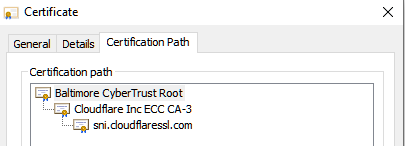

# What is mTLS?

**Mutual Transport Layer Security**, or **mTLS**, is a method by which two different devices can authenticate to eachother as a trusted source and create an encrypted channel to communicate in over TCP.  It is a specialized implementation of the more common SSL/TLS standard most known for its ability to secure connections between clients and websites. Despite its more fringe reputation when compared to plain TLS, mTLS can see notable security improvements in the right configurations when applied to the right use cases, and is quickly developing a stronger reputation as a technology worth including in production environments with good reason.

In this blog post, we'll go over a brief history of SSL/TLS, discover how modern TLS works in its latest most secure version (1.3), and then expand on our understanding of TLS by seeing what changes when an additional layer of authentication is applied, interrogating with a higher level of understanding how that might empower engineers and administrators to adapt to an increasingly changing and challenging security space.

### A brief history of SSL/TLS

In the early 90s, the internet as we know it today was in its relative infancy, and the standards we've come to expect for data security were still being developed. TCP traffic, traffic often more generally affiliated with the standard client/server relationship between hosts, was still widely serving unencrypted data in transit in clear text, therefore making it vulnerable to anyone who might be able to intercept it. To address this need for stronger security, Netscape had engineered a cryptographic protocol called **Secure Sockets Layer (SSL)** in 1994, publicly released in its second iteration, version 2.0, in 1995. From then on, SSL was continuously improved and iterated on for years, culminating in the release of SSLv3. In 2015, after numerous vulnerabilities had been discovered effecting the foundational structure of SSL, [most notably the notorious "POODLE" vulnerability](https://cve.mitre.org/cgi-bin/cvename.cgi?name=CVE-2014-3566), SSL was officially considered [deprecated by the IETF](https://datatracker.ietf.org/doc/html/rfc7568) and is no longer used or recommended in good security configurations.

**Transport Layer Security (TLS)**, which had been in development since 1999, had reached a point in its maturity (with TLS v1.2) following SSL's deprecation where it could become officially recommended as the replacement. TLS has been a standard for securing and encrypting TCP data in transit ever since. 

This history is important to note, as although SSL and TLS are functionally different in the level of protection that they can provide, the technology may still be referenced as SSL/TLS interchangably. This can be confusing, especially when industry standard software libraries like [OpenSSL](https://www.openssl.org/) are more commonly used today to only support the functionality provided by TLS. The important thing to keep note of is that whether the term SSL, TLS, or both are used, the latest versions of TLS are the only protocols that should be applied with few exceptions. Since SSL and earlier versions of TLS are considered to still be vulnerable, care should always be taken in ensuring that the latest versions of TLS (TLS 1.3 and/or TLS 1.2 if required) are always used in configurations where security and privacy is valued.

### How does TLS Work

The first problem that TLS solves is in its ability to create the conditions in which all data in transit under the protocol between a user and server is secure, encrypted, and private. It does this by leveraging assymetric encryption to safely create a shared secret between the two devices and negotiate the parameters for the desired encryption. Once the shared secret is created, it is then used more dominantly for symmetric encryption between the client and the server. In this way, TLS ensures that data in transit can be kept confidential until it reaches its destination.

Secondly, TLS allows a user to ensure that a server or client is authentic by checking its provided TLS certificate against a trusted **Certificate Authority** (CA). A Certificate Authority can be best understood as a trusted resource based primarily on the reputation of their certificates and ability to protect them. When applied to networks, CAs are generally publicially trusted by the internet at large and used to verify the authenticity of a website, host, or service. Internal CAs generally have a similarly established level of trust, though this trust can be better defined by their reputation within their LAN. The Certificate Authority issues TLS certificates to a server, signed by a digital signature using a private key, empowering a user to verify ownership against a third party using the CA's public key. Verifying ownership and having trust in this context is important, because it allows you to ensure that an encrypted connection is made to the correct person instead of an impersonator who may be attempting to steal your data. Even with strong encryption in place, that encryption only applies to the data being communicated while it is in transit, and it does not on its own identify who you are communicating with. 

In practice, this means that TLS is primarily used to stop the otherwise largely uncontested effectiveness of Man in the Middle (MITM) attacks and otherwise spoofed hosts, while providing authenticity, integrity, and confidentiality to a remote connection. TLS provides strong privacy between two hosts, and allows users to ensure that there is a level of trust in a host that can be maintained in the connection. 

Together, this secure relationship between certificates, keys, encryption, and the hardware that provides this tooling, is better known as **Private Key Infrastructure**, or PKI.

> **_NOTE:_** TLS has undergone a number of different iterations over the years, and while TLS 1.2 is still commonly configured, this guide will focus on TLS 1.3 due to the higher level of security and additional protections it can provide. It should be noted that while both TLS 1.2 and TLS 1.3 solve the same problem in a similar way, TLS 1.3 changes the formula enough that this guide should not be considered comprehensive in regards to older standards.

#### The Certificate Authority And PKI Trust Models

CAs are the root of establishing all trust within PKI. Due to this, it is important to understand the details in how CAs can be configured, and how they can be set up securely.

The first step to any certificate being issued to a host begins with public key cryptography. Public key cryptography involves a host creating a set of two keys using a cryptographic algorithm, a **Private Key** that will remain on the host that generated the key to never be shared, and a **Public Key** to be shared. Together, these keys are called a **key pair**. Given the way that the algorithm involved generates a key pair, the public key and private key are a mathematical match to each other. A key pair can be used for a number of different purposes, however in terms of a CA and TLS, it is important to understand that a private key can be used to digitally sign certificates. A digital signature can be understood simply as a message of ownership that demonstrates authenticicty of a host, verifying the identity of the sender as the holder of the private key, and establishing trust. TLS certificates are therefore always signed using the private key of a certificate authority, and the public key is always shared with users who need to trust that certificate authority in order to proceed with their own tasks with established trust. The public key therefore verifies authenticity by ensuring that it is a match to a digital signature.

When a host needs its own trusted SSL certificate, it will generally submit a **Certificate Signing Request** (CSR) which largely functions exactly as described. A CSR is generally submitted as follows:

  1. Using its own key pair, the host sends a CSR signed by its private key and a copy of its public key over to a CA.
  2. Using the public key, the CSR itself, and any additional information that may be optionally required by the CA (usually a domain name), it will verify that the host is who they claim to be. Once this verification is complete, the CA will use its own private key to add its signature to a Certificate and then send the signed certificate back to the host.

Once a host has its certificate,users and administrators can check the certificate signature using the CAs public key, to ensure that the host is who they claim to be. 

While a single CA is a good start in helping to verify identity, there is one problem. What happens if the private key of the CA becomes compromised in a security incident or data breach? Since a private key can decrypt everything encrypted with the key pair, it can effectively decrypt all messages signed using it, and otherwise be leveraged to create certificates that are deceptively "trusted" outside of the standards that a CA usually enables.  If a CA becomes compromised, this effectively renders all certificates it issues as useless since the CA can now be leveraged for all sorts of nefarious purposes, including applying its signature to malware. If a CA is no longer considered authentic, the trust in all certificates under it are considered useless. In configurations with one single CA, this creates a single point of failure, and a level of risk reasonably considered unacceptable in a majority of use cases. Fortunately, multiple CAs generally help to verify trust in eachother. While there are a few different approaches to how CAs should relate to eachother, they will generally provide limited certificates to other CAs, reducing the scope of risk and creating a **chain of trust**. There are a number of **PKI Trust Models** that apply this concept well for different use cases, however for the purposes of this blog post we'll focus on one of the most common, the **Hierarchical Trust Model**.

In the hierarchical trust model, a **Root CA** will create and issue a digitally signed certificate under intense scrutiny to only a few trusted **Intermediate CAs** to limit the risk of exposure of its all powerful private key, helping to distribute risk. Next, the intermediate CA can either issue a certificate to another intermediate CA using a brand new key pair, or it can issue a certificate directly to a host or "Leaf CA" that clients will interact with. This **Leaf CA** or **End Entity** can generally be thought of as the final host that end users themselves will interact with to access a service. In this trust model, the compromise of the private key of the root CA can still lead to the breakdown of a chain of trust until all certificates under it are recursively rotated, however it applies a higher level of protection by limiting the exposure of the root CA and better distributing the risk involved. This trust model can even be observed at work directly in your web browser, usually by clicking on a lock icon to the left of the search bar and selecting the option to view certificates. The chain of trust for the TLS cetificate of Teleport's home page, for example, currently appears as follows within my browser:

The chain of trust applied by a working trust model can be additionally distributed among more than one Root CA, meshed together, or otherwise linked and distributed as needed for your organization. It is worth keeping in mind that what works for the internet at large may not be best for an internal use case, and internal LAN PKIs generally have the benefit of applying more rigorous and selective standards to the infrastructure they manage, such as intentionally rotating certificates and keys on a regular cadence to help limit the scope of any potential breach, or strictly enforcing stronger encryption and identity standards.

While PKI trust models are necessarily imperfect, they dramatically increase the effectiveness of certificate security when combined with defense in depth, and are a standard when using TLS. Regardless of what trust model you ultimately use for your own use cases, it is generally good practice to apply the basics of PKI and chains of trust wherever they are reasonably applicable. 

#### TLS Under the Hood

The more intricate details of a TLS connection can be explored in a numbers of ways, however at the highest level they may be best understood by the concept of by two sub protocols of TLS as defined by the [Internet Engineering Task Force (IETF)](https://datatracker.ietf.org/doc/html/rfc8446):

- The **Handshake Protocol**, more commonly referred to as a **TLS Handshake**, which authenticates both devices involved in the connection and negotiates the conditions for cryptography, taking special steps to establish all relevant key data.

- The **Record Protocol**, which uses the parameters agreed upon by the TLS Handshake to protect all encryptable traffic. The record protocol is responsible for dividing traffic into smaller components, or "Records", each of which are independently protected by the shared symmetric key and the encryption provided.

While it is important to understand that the Record Protocol is responsible for the active encryption that TLS provides once the TLS handshake has been completed, we'll be focusing on the Handshake Protocol in this blog post since it actively defines most of the passive behavior of the Record Protocol and is essential to understanding how TLS works and how mTLS differs.

Additionally, when talking about TLS, it is important to understand the concept of a **Key Exchange** or **Key Share**. In a Key Share on TLS, two users will generate both a public Key and a private key, and then share their public keys with eachother. The shared public key is then compared to the personal private key and a number of complex calculations are made, enabling both users to arrive at the same shared secret. TLS 1.3 does this using the process more commonly called the **Diffie Hellman Key Exchange**. While this blog will not cover the full details of Diffie Hellman cryptography, it is important to understand these core concepts to better understand TLS.

#### The Default TLS Handshake

The standard **TLS Handshake** on TLS 1.3 can be understood from start to finish as the following multi-step process, generally not deviating much except in special configurations:

1. The client consolidates its configuration data, generates public and private keys, and will reach out with a request to the server using a `ClientHello` message to negotiate the conditions of the connection. The ClientHello message sends the server information including the latest version of TLS that the client can support, a list of accepted cipher suites, one or more of the clients public keys, and a random nonce which can be used to verify identity of the client if any potential tampering is suspected. It is important to note that when the the client is providing public keys, it is making an informed guess of the type of cryptography the server would like to use within its allowed limits before any actual negotiation takes place, helping to reduce the time it takes to complete the handshake and transmit data faster should the guess be correct.

2. When the server receives the client's request, it parses the data as necessary, selecting from the lists of available options outlined by the clients message. Using the public key of the client against the server's own private key, the server is now additionally able to generate the shared secret key to be used for encryption and decryption. Next, the server responds back to the client with a `ServerHello` message. This message will include the negotiated connection parameters, a unique random nonce used to verify the server's identity in the event that tampering is suspected, the version of TLS that will be used, the server's public key, the determined cipher suite, information on the TLS certificate, and a confirmation that the server is now finished with its part of the handshake. 

3. The client will receive the ServerHello message and parse it as needed. The TLS certificate of the server is received, and is now checked against a trusted Certificate Authority using the certificate's digital signature. Once verified, the client sends the server a message confirming that it is finished with its part of the handshake, and data can now be encrypted and decrypted as needed between the two machines. 

The TLS 1.3 handshake doesn't usally deviate from the expected behavior above, though will automatically go through some adjustments in some edge cases, such as if the protocol detects tampering or the `ClientHello` was unable to guess the correct kind of cryptography. The TLS handshake can also be intentionally configured to behave differently by an administrator in special configurations, such as if a pre-shared key (PSK) is used.

It is worth keeping in mind that in common TLS implementations, such as the TLS relationship between your client and this website, there isn't any need to check for client authenticity outside of ensuring that the client remains the singular client that originally initiated this connection. While TLS normally takes steps to ensures that both client and server remain the same throughout the connection, it is not required to ensure that the client is trusted. As far as common TLS configurations are concerned, a client can be almost anyone as long as they consistently stay themselves. 

### What Makes mTLS different? 

Mutual TLS, or mTLS provides the same traffic encryption provided by TLS, while ensuring that the client is additionally authenticated by the server. This ensures that both client and server have verified the identity of eachother cryptographically via a trusted certificate authority. To best understand this, it is worth highlighting the ways in which mTLS is still the same as traditional TLS:

- mTLS is not a separate protocol from TLS, it has been an optionally supported feature of SSL/TLS for years 
- mTLS provides encryption defined in the Record sub protocol of TLS 1.3 in the exact same way as traditional TLS.
- mTLS only adjusts the TLS Handshake to include steps for the server to verify the authenticity of the client.

#### Revisiting the TLS Handshake

Let's revisit the TLS handshake to better understand what happens under the hood when mTLS is desired as part of your configuration. This outline will have parity with the same numerical steps outlined in the "Default TLS Handshake" sub section of this blog post, however now only the differences will be highlighted:

1. There are no changes.
2. The `ServerHello` message now includes a Certificate Request, informing the client that they require information regarding their TLS certificate. The server will **not** send a message confirming that it is finished with its part of the handshake.
3. The client will additionally include information regarding its TLS certificate, including its digital signature, in a message to the host to demonstrate that it does own the private key affiliated with the certificate as defined by the certificate authority. The client lets the server know that it is finished with its part of the handshake.
4. The server will respond with a message confirming that it is finished with its part of the handshake. Data can now be encrypted and decrypted between the two hosts.

### A note on mTLS Infrastructure

In mTLS, Certificate Authorities will need to be internally managed. While chains of trust and strong PKI can and should generally be used in these applications where applicable, it is worth noting that CAs often require stronger security controls than other devices given their critical nature. To ensure CAs are put under a high level of scrutiny, users and administrators should consider applying the following security controls to their CAs:

  - **Hardware Security Modules (HSM)** - A Hardware security module is a device built on specialized hardware to protect cryptographic keys, ensure strong encryption, and otherwise provide a high level of performance. These are devices that generally have strong security built in given their singular nature and are designed to be tamper and intrusion resistant.
  - **Intrusion Prevention Systems** - Intrusion Prevention Systems are designed to monitor and inspect network traffic, blocking unwanted or malicious traffic and providing logging for security teams to analyze in the event of any incident.
  - **Strong network access controls and Network Isolation** - A CA should not be given more network access than needed to function, in line with the principle of least privelege. Similarly, only users who absolutely need access to a CA should be able to acces it for this purpose. Consider making your CA a single function device, used for the singular purpose of functioning as a CA.

### Why Use mTLS

In any context where identity must be considered authentic and encryption for data in trasit is provided, mTLS provides a higher level of security than standard TLS can provide alone by ensuring that both client and server are able to establish trust and authenticity in eachother's identity. While this change may seem small at first glance, it is important to keep in mind that in the same way that TLS without authentication can make TLS vulnerable and no longer effective, mTLS too can see exponential benefits by authenticating a previously unauthenticated device. Authenticity gives infrastructure the means to better protect the needs of a network, and unlocks the full capabilities of pre-existing technologies. This is especially true for the zero trust model and defense in depth, however can be applied more selectively as needed. 

Consider an internal LAN implementing a zero trust approach to network security. This organization is doing everything right, but by enforcing mTLS can now add identity controls to their internal LAN that can help prove that those within it are who they say they are. Traffic that otherwise makes it through a firewall can now be denied for those who do not hold certificates just by the nature of how those connections are necessarily made. This organization can go beyond a typical allowlist firewall and provide an additional layer of defense even if a firewall is breached, empowering all traffic to be encrypted unless explicitly stated otherwise and denying all traffic that cannot be identified by a trusted certificate. This means that all information can be distributed as needed, elegantly applying the principle of least privelege. Mutual TLS can be used to further secure SSH sessions, building on the concepts of public key authentication and further ensuring that a connection is trusted both ways. Where internal APIs are needed and especially if combined with regular automated cert rotation and good user access controls bound to those certificates, mTLS can help to increase the security of API access traditionally granted by access tokens. If Kubernetes clusters are involved, a kubernetes service mesh can be used to apply mTLS to your cluster's internal network, and cloud infrastructure can further apply mTLS concepts where applicable. The popular Oauth 2.0 model can be further improved upon by binding access tokens to certificates, increasing the protection provided by its already strong standard for authorization.

While the specific use cases and applications for mTLS are broad, the best reason to use it perhaps is this. In a rapidly evolving and complex security ecosystem where trust should never be assumed implicitly, mTLS provides a strong backbone in determining and enforcing explicit standards for who should and should not be trusted within a network. By the very nature of how mTLS works, it enables and empowers administrators and engineers to create strong conditions of confidentiality, integrity, and authenticity within infrastructure and networks that they control. Especially when combined with other techologies, mTLS is a critical concept that should be understood to create ideal circumstances for the highest levels of security in a wide array of scenarios.

### Conclusion

The Transport Layer Security protocol has traditionally been one of the strongest layers of security applied to modern day technology, providing strong encryption to data in transit and proving authenticity of hosts. By implementing a stronger set of security controls empowered by the added authenticity Mutual TLS provides, organizations can better support the zero trust model, helping them to proactively stay ahead of any potential threats in a rapidly evolving security ecosystem. Mutual TLS is an improvement over TLS in a wide array of applications, and may be able to help your organization to stay better protected than ever before.
